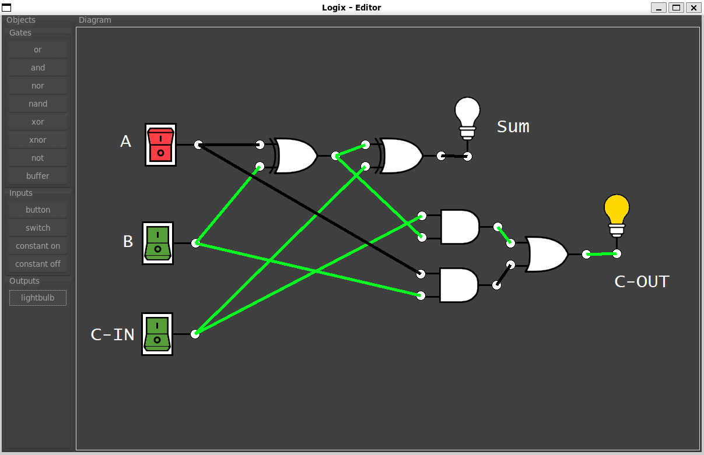

# logix 
<h3>A free logic gate simulator. Create and experiment with simple logic gate circuits in this minimal editor powered by python..</h3>

Wanting to learn more about circuits and use an interactive tool to create logic diagrams?
Logix is free software that gives you an intuitive editor to switly build and test circuits and futher your knowledge of electronic computation.

#
Example: A full adder circuit diagram drawn in logix

❤️
